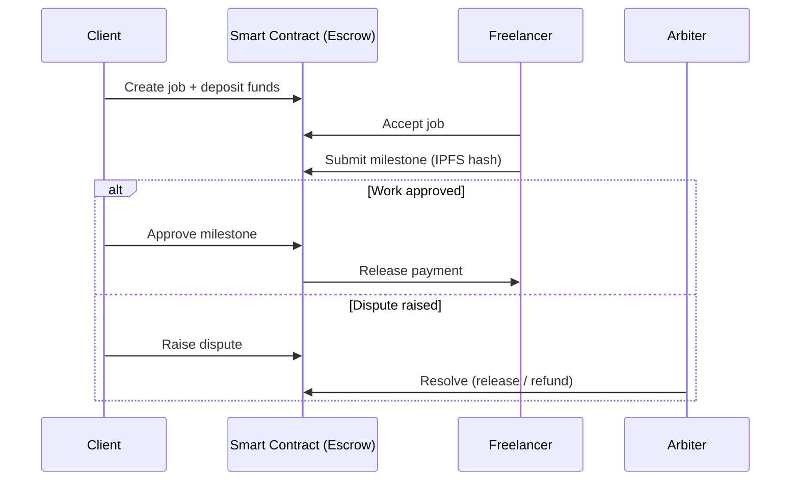
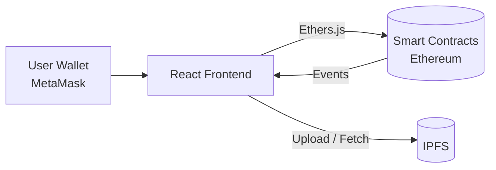

<div align="center">

# ⛓️ ChainLance

### Decentralized Freelance Marketplace with Trustless Escrow

*Hire, work, and get paid — without middlemen, hidden fees, or payment disputes.*


[Live Demo](#) · [Report Bug](../../issues) · [Request Feature](../../issues)

</div>

---

## 📌 Overview

Traditional freelance platforms take **10–20% fees**, hold your money for days, and act as a single point of trust. **ChainLance** replaces that middleman with smart contracts.

A client locks funds in an **on-chain escrow**. The freelancer delivers work milestone by milestone. Payment is released automatically on approval — or resolved through a transparent dispute process if something goes wrong.

## ✨ Features

- 🔐 **Escrow Smart Contract** — client funds are locked on-chain until work is approved
- 🎯 **Milestone-Based Payments** — split a job into stages, pay as each one is delivered
- 👤 **On-Chain Profiles** — freelancers and clients identified by wallet address
- ⭐ **Tamper-Proof Reputation** — ratings and completed-job history stored on-chain
- ⚖️ **Dispute Resolution** — arbiter can release or refund funds if parties disagree
- ⏳ **Auto-Refund on Deadline** — client can reclaim funds if the freelancer never delivers
- 📁 **IPFS Storage** — job descriptions and deliverables stored off-chain, hash kept on-chain
- 🦊 **MetaMask Integration** — connect wallet and sign transactions from the browser

## 🔄 How It Works



## 🏗️ Architecture



## 🛠️ Tech Stack

| Layer | Technology |
|---|---|
| Smart Contracts | Solidity, OpenZeppelin |
| Development & Testing | Hardhat, Chai, Ganache |
| Frontend | React.js, Ethers.js, CSS3 |
| Storage | IPFS |
| Wallet | MetaMask |
| Network | Ethereum (Sepolia testnet) |

## 📂 Project Structure

```
ChainLance/
├── contracts/
│   ├── FreelanceEscrow.sol      # Core escrow + milestone logic
│   └── Reputation.sol           # On-chain ratings
├── scripts/
│   └── deploy.js                # Deployment script
├── test/
│   └── FreelanceEscrow.test.js  # Unit tests
├── frontend/
│   ├── src/
│   │   ├── components/
│   │   ├── pages/
│   │   └── utils/               # Contract ABI + helpers
│   └── package.json
├── hardhat.config.js
├── .env.example
└── README.md
```

## 📜 Smart Contract Overview

| Function | Who | Description |
|---|---|---|
| `createJob()` | Client | Creates a job and deposits payment into escrow |
| `acceptJob()` | Freelancer | Accepts an open job |
| `submitMilestone()` | Freelancer | Submits deliverable (IPFS hash) for a milestone |
| `approveMilestone()` | Client | Approves work and releases that milestone's payment |
| `raiseDispute()` | Client / Freelancer | Freezes funds and flags the job for arbitration |
| `resolveDispute()` | Arbiter | Releases or refunds the locked funds |
| `claimRefund()` | Client | Reclaims funds if the deadline passes with no delivery |
| `rateFreelancer()` | Client | Leaves an on-chain rating after completion |

## 🚀 Getting Started

### Prerequisites

- [Node.js](https://nodejs.org/) v18+
- [MetaMask](https://metamask.io/) browser extension
- Sepolia test ETH ([faucet](https://sepoliafaucet.com/))

### 1. Clone the repository

```bash
git clone https://github.com/Rohit12ka/ChainLance.git
cd ChainLance
```

### 2. Install dependencies

```bash
npm install
cd frontend && npm install && cd ..
```

### 3. Configure environment

Copy `.env.example` to `.env` and fill in your values:

```env
ALCHEMY_API_URL=your_alchemy_sepolia_url
PRIVATE_KEY=your_wallet_private_key
```

> ⚠️ **Never commit your `.env` file or share your private key.** Use a dedicated test wallet.

### 4. Compile & test

```bash
npx hardhat compile
npx hardhat test
```

### 5. Deploy

```bash
# Local network
npx hardhat node
npx hardhat run scripts/deploy.js --network localhost

# Sepolia testnet
npx hardhat run scripts/deploy.js --network sepolia
```

Copy the deployed contract address into `frontend/src/utils/config.js`.

### 6. Run the frontend

```bash
cd frontend
npm start
```

Open [http://localhost:3000](http://localhost:3000) and connect your MetaMask wallet.

## 🔒 Security Considerations

- Funds are held by the contract, never by an individual or the platform
- Uses OpenZeppelin's `ReentrancyGuard` on all payout functions
- Checks-Effects-Interactions pattern followed for every ETH transfer
- Role-based access control for client, freelancer, and arbiter actions
- Unit tests cover the happy path, dispute flow, and refund edge cases

> This project is for learning and portfolio purposes and has **not** been professionally audited. Do not use with real funds on mainnet.

## 🗺️ Roadmap

- [x] Escrow with milestone payments
- [x] Dispute resolution by arbiter
- [x] IPFS-based deliverable storage
- [ ] ERC-20 stablecoin payments (USDC / DAI)
- [ ] Multi-arbiter DAO voting for disputes
- [ ] Soulbound NFT badges for completed jobs
- [ ] Real-time notifications via contract events
- [ ] Layer-2 deployment (Polygon / Arbitrum) for lower gas fees

## 🤝 Contributing

Contributions are welcome!

1. Fork the repository
2. Create your branch: `git checkout -b feature/amazing-feature`
3. Commit your changes: `git commit -m "Add amazing feature"`
4. Push to the branch: `git push origin feature/amazing-feature`
5. Open a Pull Request

## 📄 License

Distributed under the MIT License. See `LICENSE` for details.

## 👨‍💻 Author

**Rohit Kumar**
Web3 & MERN Developer · B.Tech CS (AI)

[](https://linkedin.com/in/rohit-kumar-5309b022a)
[](https://rohit12ka.netlify.app)
[](mailto:rohitkumar27965@gmail.com)

---

<div align="center">

⭐ If you found this project useful, consider giving it a star!

</div>
